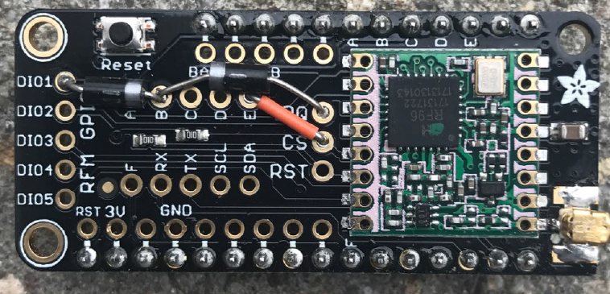
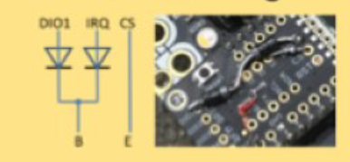

# Assembly of the Adafruit LoRa Radio FeatherWing
This document shows how to assemble the Adafruit LoRa Radio FeatherWing
and how to wire it up in a way to be used by the LMIC library.

For the assembly, you need
* The [Adafruit LoRa Radio FeatherWing](https://learn.adafruit.com/radio-featherwing)
* The pin headers included 
* A jumper wire
* 2 Diodes 1N4001
* An antenna wire (8.2cm length)

Stick the included pin headers in a breadboard and put the FeatherWing on it.
Solder the pin headers.

Downside view:

Connect pin `CS` with pin `E` using a wire jumper.

Connect both pin `IRQ` and pin `DIO1` with pin `B` using Diodes. 
The direction of the diode is essential: Make sure that the cathode (marked with the silver ring)
is located on the side near the `B` pin.

View from top

Cut a stranded or solid core wire to 8.2cm length and solder it into the ANT pad.
