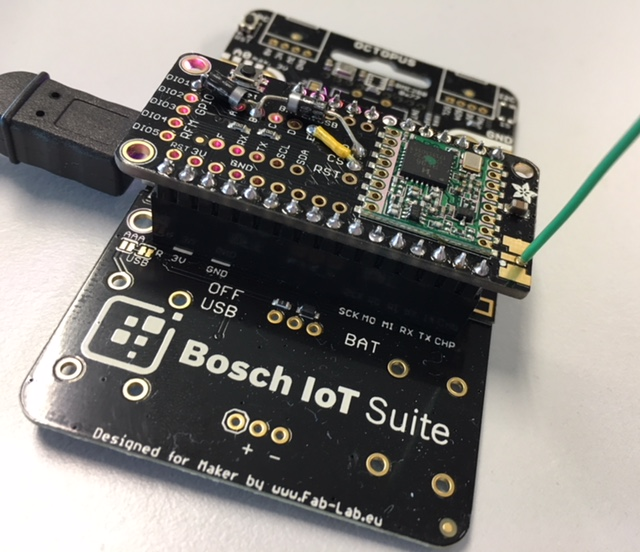
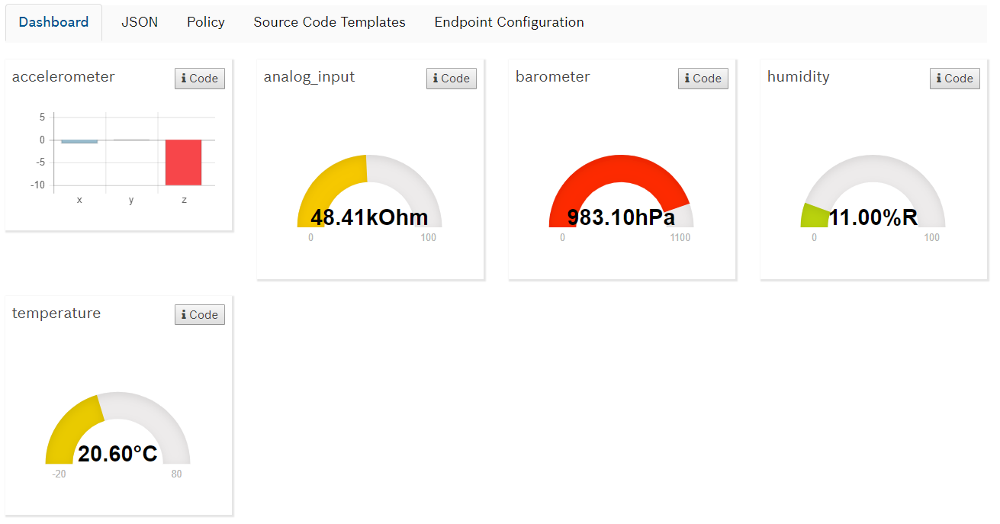

# Octopus LoRa Radio Example
An example Arduino sketch to demonstrate how to use the [Octopus board](http://fab-lab.eu/octopus/) in 
combination with an [Adafruit LoRa Radio FeatherWing](https://learn.adafruit.com/radio-featherwing) to send sensor telemetry
using Low-Power Wide-Area networks using LoRaWAN.

The example uses the sensors [Bosch BME680](https://www.bosch-sensortec.com/bst/products/all_products/bme680) (Environment) 
and [Bosch BNO0555](https://www.bosch-sensortec.com/bst/products/all_products/bno055) (Accelerometer)
to periodically send sensor data using the [Cayenne Low Power Payload (CayenneLPP)](https://github.com/myDevicesIoT/cayenne-docs/blob/master/docs/LORA.md) format.

The LoRaWAN communication part (Joining the LoRa network with OTAA and using the LMIC framework)
is based on work of Thomas Telkamp and Matthijs Kooijman which
can be found here: https://github.com/matthijskooijman/arduino-lmic/blob/master/examples/ttn-otaa/ttn-otaa.ino

Instructions for assembly and wiring it up can be found here: [ASSEMBLY.md](ASSEMBLY.md).

## Arduino IDE Setup
Follow the instructions given here:
https://learn.adafruit.com/adafruit-feather-huzzah-esp8266/using-arduino-ide

When finished, you should be able to get the "Blink Test" sketch running successfully.

### Libraries
You need to install several libraries in the Arduino IDE

Sketch --> Include Library --> Manage Libraries ...

* "IBM LMIC Framework - Arduino Port of the LMIC"
* "Adafruit Unified Sensor"
* "Adafruit BME680 Library"
* "Adafruit BNO055"
* "CayenneLPP" by The Things Network

## Connectivity to the Bosch IoT Hub
The LoRa Network server needs to forward the device's payload to the HTTP Connector of
the Bosch IoT Hub. Please use the LoRaWAN Reverse Proxy Server to connect.

* Actility ThingParkPartner: Use URL https://lorawan-reverse-proxy.apps.de1.bosch-iot-cloud.com/actility?apikey=abc123
* The Things Network: Use URL https://lorawan-reverse-proxy.apps.de1.bosch-iot-cloud.com/ttn?apikey=abc123

Please ask the Hack Coaches for a valid `apikey`, as the one given here does not work.

## Informationmodel in Eclipse Vorto
Please note that there is already a information model prepared in Eclipse Vorto that can
be used for this example:

**OctopusLoRaFeatherWing** InformationModel

    namespace com.bosch.bcx2018
    version 1.0.0
    displayname "OctopusLoRaFeatherWing"
    description "Information Model for OctopusLoRaFeatherWing"
    category iot

    using com.ipso.smartobjects.Temperature; 0.0.1
    using com.ipso.smartobjects.Barometer; 0.0.1
    using com.ipso.smartobjects.Humidity; 0.0.1
    using com.ipso.smartobjects.Analog_Input; 0.0.1
    using com.ipso.smartobjects.Accelerometer; 0.0.1
    
    infomodel OctopusLoRaFeatherWing {
	
	    functionblocks {
		    temperature as Temperature
		    barometer as Barometer
		    humidity as Humidity
		    analog_input as Analog_Input
		    accelerometer as Accelerometer
	    }
    }

Custom payload mappers that map the sensor data given in the CayenneLPP format payload
to the Ditto format were already set up for this information model. Using this information model,
you directly get the sensor data in your "digital twin" in "Things".

